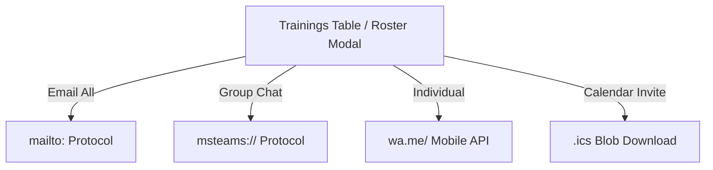

# ProTrain Version 34 Architectural & Feature Analysis

This document provides a comprehensive technical analysis of **ProTrain Version 34** (`training_planner_34.html`), which focuses on **Comprehensive Data Modeling & Participant Management**. It also includes insights on the experimental Version 35 changes observed in the workspace.

---

## 1. System Architecture & Tech Stack

ProTrain is designed as a **self-contained, single-file browser application (SPA)**.
* **Core Technologies**: HTML5, Vanilla CSS3 (custom styling system), and Vanilla JavaScript (ES6+).
* **Storage**: Browser-native `localStorage` via synchronous JSON serialization. Data persists locally per browser profile and does not sync to any server.
* **Access Control**:
  * **Viewer Role**: Read-only, no PIN required. Limits interactive changes by hiding/disabling write buttons.
  * **Admin Role**: Read-write, unlocked via a 4-digit PIN (default: `0110`). The PIN is hashed using SHA-256 (`hashPin` function) and stored in `localStorage` as `DEFAULT_PIN_HASH`.

---

## 2. Core Data Models (State Schema)

All application data is stored under a single global JavaScript object, `data`. Below is the structural schema of the database:

```json
{
  "trainers": [
    {
      "id": "string (t1, t2, ...)",
      "name": "string",
      "expertise": "string",
      "color": "string (hex)",
      "leaves": [
        {
          "id": "string",
          "startDate": "string (YYYY-MM-DD)",
          "endDate": "string (YYYY-MM-DD)"
        }
      ]
    }
  ],
  "rooms": [
    {
      "id": "string (r1, r2, ...)",
      "name": "string",
      "capacity": 50,
      "color": "string (hex)"
    }
  ],
  "trainings": [
    {
      "id": "string (tr1, tr2, ...)",
      "name": "string",
      "subSection": "string (e.g., CC Training)",
      "startDate": "string (YYYY-MM-DD)",
      "endDate": "string (YYYY-MM-DD)",
      "duration": 5, 
      "hoursPerDay": 8,
      "trainerId": "string",
      "roomId": "string",
      "color": "string (hex)",
      "isOnline": false,
      "participants": [
        {
          "id": "string",
          "name": "string",
          "empId": "string",
          "email": "string",
          "phone": "string",
          "department": "string",
          "active": true
        }
      ]
    }
  ],
  "tasks": [],
  "holidays": [
    {
      "id": "string",
      "name": "string",
      "date": "string (YYYY-MM-DD)"
    }
  ],
  "settings": {
    "pinHash": "string (SHA-256)"
  }
}
```

---

## 3. Key Feature Analysis (Version 34)

### 3.1 Enhanced Participant Data Model & Roster UI
* ** Roster Schema**: Expands the participant records from 4 points to 15+ potential metadata points, standardizing fields like `phone` and `active` status.
* **Global Participants Roster**:
  * Added a master navigation page `participants-global` that aggregates all participant rosters across every training session.
  * Search and sorting are implemented in JS via `renderGlobalParticipantsTable()`, matching terms across `name`, `empId`, `email`, `phone`, `department`, and `trainingName`.
* **Animated Toggles**: Replaced static buttons with smooth CSS iOS-style toggle switches:
  ```css
  .ios-switch {
      position: relative;
      display: inline-block;
      width: 36px;
      height: 20px;
  }
  .ios-switch input { opacity: 0; width: 0; height: 0; }
  .slider {
      position: absolute;
      cursor: pointer;
      top: 0; left: 0; right: 0; bottom: 0;
      background-color: #cbd5e1;
      transition: .2s;
      border-radius: 20px;
  }
  .slider:before {
      position: absolute;
      content: "";
      height: 16px; width: 16px;
      left: 2px; bottom: 2px;
      background-color: white;
      transition: .2s;
      border-radius: 50%;
  }
  input:checked + .slider { background-color: var(--success); }
  input:checked + .slider:before { transform: translateX(16px); }
  ```
* **Bulk Roster Actions**: Checkboxes allow multi-selection of participants globally. Planners can bulk activate, deactivate, or delete selected enrollments via `bulkParticipantStatus()` and `bulkParticipantDelete()`.

### 3.2 Raw Data Paste Parsing
To bypass file upload security blocks on local machines, a fallback text-area copy-paste mechanism is supported.
* **Function**: [processParticipantText](file:///c:/Users/User/Downloads/protrain/training_planner_34.html)
* **Logic**:
  1. Splitting content by lines (`\n`).
  2. Detecting headers (Name, Employee ID, Department, Email, Phone) case-insensitively using regex matching on the first row.
  3. Parsing data cells, defaulting to tab separation (Excel copy-paste behavior) and falling back to comma separation (CSV).
  4. Preventing duplicate employee IDs per session during ingestion.

### 3.3 Communication Actions & Protocols
To streamline administrative workflows, direct messaging and calendar creation protocols are embedded natively:



* **Email All (`emailTrainingParticipants`)**:
  * Merges emails with semicolon separators.
  * Uses `mailto:?bcc={emails}&subject={subject}&body={body}` to launch default mail clients securely while maintaining participant BCC privacy.
* **Teams Group Chat (`teamsTrainingParticipants`)**:
  * Utilizes MS Teams deep link: `https://teams.microsoft.com/l/chat/0/0?users={emails}&topicName={topic}&message={msg}`.
* **WhatsApp Link (`whatsappTrainingParticipants`)**:
  * Directs to `https://wa.me/{phone_number}` stripped of non-numeric symbols.
* **Calendar invite (`downloadTrainingICS`)**:
  * Generates an iCalendar RFC 5545 format text blob.
  * Adjusts the end date `DTEND` by adding 1 day to the training end date, since ICS date values are **exclusive** of the end date.
  * Triggers download via browser `Blob` and `URL.createObjectURL`.

### 3.4 Date Standardization
* Standardizes all dates in UI displays, exports, and modals to `dd-mm-yyyy` using [formatDateToDDMMYYYY](file:///c:/Users/User/Downloads/protrain/training_planner_34.html).
* Internally, dates are parsed and computed using `YYYY-MM-DD` (ISO Standard) to prevent locale-specific parsing errors.

---

## 4. Key Helper Functions & Logic

### 4.1 Working Days Calculation
```javascript
function getTrainingWorkingDays(training) {
    if (!training.startDate || !training.duration) return [];
    let start = parseDate(training.startDate);
    let duration = parseInt(training.duration);
    let list = [];
    let current = new Date(start);
    let loops = 0;
    
    while (list.length < duration && loops < 1000) {
        loops++;
        let dayKey = formatDate(current); // YYYY-MM-DD
        
        // Skip weekends and public holidays unless overridden
        let isWk = isWeekend(current);
        let isHoli = isHoliday(dayKey);
        let hasOverride = training.dayOverrides && training.dayOverrides.includes(dayKey);
        
        if (hasOverride || (!isWk && !isHoli)) {
            list.push(new Date(current));
        }
        current.setDate(current.getDate() + 1);
    }
    return list;
}
```

### 4.2 Resource Conflicts Checks (`checkConflicts`)
Executed on modifications or drag-and-drop actions. Evaluates:
1. **Trainer overlap**: Compares trainer working days across all trainings/tasks.
2. **Room overlap**: Checks room booked status.
3. **Trainer Annual Leave**: Warnings if training intersects with trainer leaves.
4. **Holiday Booking**: Detects sessions intersecting registered company holidays.

---

## 5. Preliminary Insights: Version 35 Development

A file named `training_planner_35.html` is present in the workspace. While not documented in the main `version_history.md`, it contains significant additions representing **BI Dashboard Integration**:
1. **External Libraries Loaded**:
   * `xlsx.full.min.js`: For native Excel file upload parsing.
   * `html2canvas.min.js`: For capturing DOM container components as PNGs.
   * `jszip.min.js`: For archiving captured chart images into a single `.zip` file.
2. **Features**:
   * **BI Dashboard View**: A dashboard containing metrics for Headcount, Avg Certification %, Throughput (TPUT), and First-Time Pass.
   * **Filters & Slicers**: Dynamically interactive selectors for Partner, Location, and LOB (Line of Business).
   * **Dynamic Charts**: Vertical bar chart render engine built using vanilla HTML/CSS custom bars with animated linear-gradient shimmers.
   * **Interactive Pivot Table**: Aggregates metrics grouping by Partner, LOB, and Location.
   * **Download Zip**: Compiles all charts into a single `.zip` archive via `downloadAllChartsZip`.

---

## 6. Ready State

The application is structured logically with clear boundaries between rendering methods and calculations. I am ready to perform modifications, add new fields, tweak styling elements, update calculation scripts, or troubleshoot existing logical scripts.
